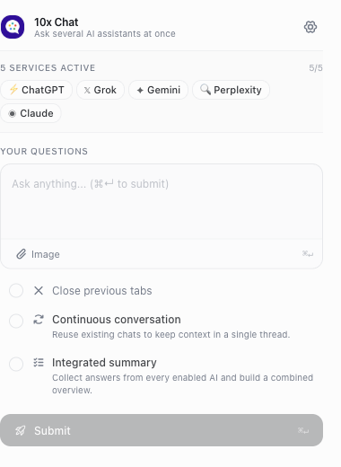
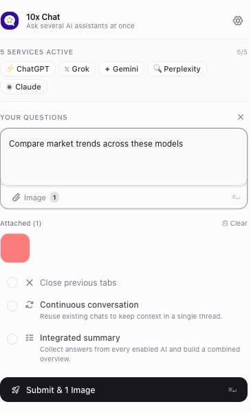
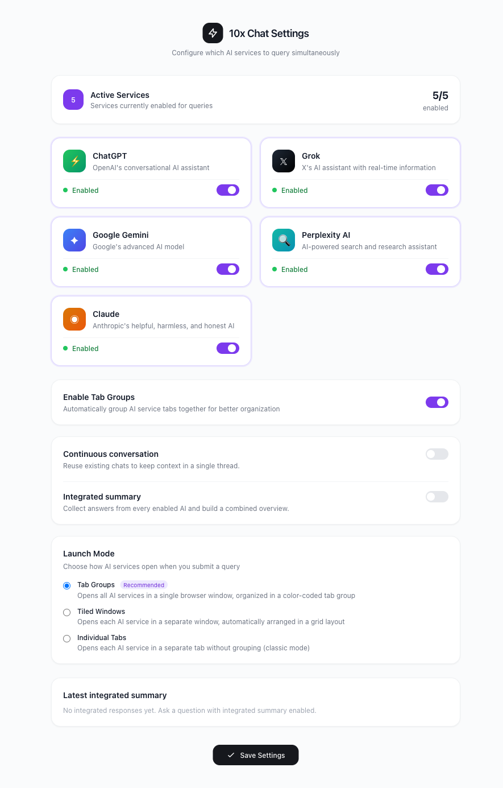
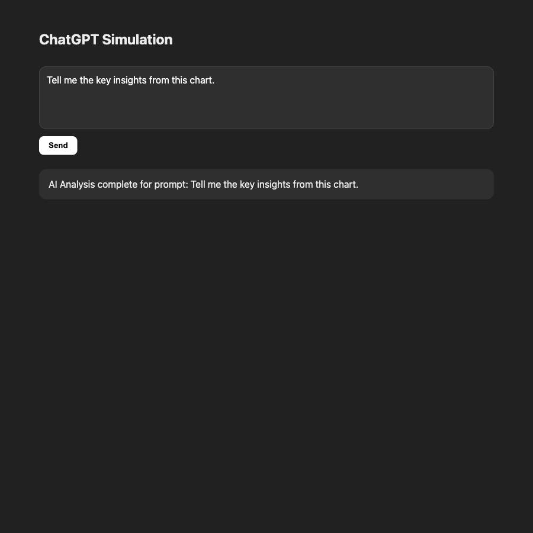

<div align="center">

# 10xWise: Multi-AI Chat

**One prompt. Multiple AI assistants. Instant side-by-side answers.**

[](https://chromewebstore.google.com/detail/10xwise-multi-ai-chat/jamoinmdfbdocjnggffobhmpogbolncp)
[](LICENSE)
[](https://wxt.dev/)
[](https://www.typescriptlang.org/)
[](https://react.dev/)

[Install from Chrome Web Store](https://chromewebstore.google.com/detail/10xwise-multi-ai-chat/jamoinmdfbdocjnggffobhmpogbolncp) • [Features](#features) • [Getting Started](#getting-started) • [Supported Models](#supported-ai-assistants) • [License](#license)

</div>

---

## Overview

**10xWise Multi-AI Chat** (`10x-chat-browser`) is an open-source Manifest V3 Chrome extension that lets you query the world's best AI assistants simultaneously with a single prompt.

Skip copying and pasting prompts between multiple browser tabs. Compare responses in real time across **Google Gemini**, **ChatGPT**, **Claude**, **Grok**, and **Perplexity AI** directly using your existing web sessions.

- **Zero API keys needed**: Interacts directly with the official web apps you are already logged into.
- **Privacy-first & local**: Operates 100% client-side inside your browser. No middleman proxies, tracking, or external logging servers.
- **Image attachments supported**: Send images via drag-and-drop, paste, or file upload to all compatible models at once.

---

## Preview

<div align="center">

| Quick Dispatch Popup | Multi-Image Attachments |
| :---: | :---: |
|  |  |

| Customizable Options & Launch Modes | Seamless In-Browser Prompt Injection |
| :---: | :---: |
|  |  |

</div>

---

## Features

- ⚡ **Simultaneous Multi-AI Dispatch**: Write your query once and submit it across all active assistants simultaneously.
- 🖼️ **Multi-Image Attachments**: Drag and drop, paste from clipboard, or browse images to attach them to your query. The extension automatically encodes and delivers them to supported assistant editors.
- 🗂️ **Customizable Launch Modes**:
  - **Tab Groups**: Open all active assistants within a tidy, color-coded Chrome tab group in a single window.
  - **Tiled Windows**: Automatically tile each assistant window across your display in an optimized grid layout for side-by-side comparison.
  - **Individual Tabs**: Traditional multi-tab workflow.
- 🔄 **Continuous Conversations**: Reuse existing conversation tabs to preserve multi-turn context across follow-ups without creating fresh threads each time.
- 📊 **Integrated Summary**: Aggregate and synthesize answers from multiple models into an executive overview.
- 🌐 **Internationalization (i18n)**: Fully localized in English, Spanish (Español), German (Deutsch), French (Français), Simplified Chinese (简体中文), and Traditional Chinese (繁體中文).
- ⌨️ **Keyboard Shortcuts**: Quick submit with `Cmd+Enter` (macOS) / `Ctrl+Enter` (Windows/Linux).

---

## Supported AI Assistants

| Assistant | Provider | Web Endpoint | Multi-Image Support |
| :--- | :--- | :--- | :---: |
| **ChatGPT** | OpenAI | `chatgpt.com` | ✅ |
| **Google Gemini** | Google | `gemini.google.com` | ✅ |
| **Claude** | Anthropic | `claude.ai` | ✅ |
| **Grok** | xAI | `grok.com` | ✅ |
| **Perplexity** | Perplexity AI | `perplexity.ai` | ✅ |

---

## Tech Stack

- **Extension Framework**: [WXT](https://wxt.dev/) (Next-Gen Web Extension Framework, Manifest V3)
- **UI & Components**: React 18, [Tailwind CSS](https://tailwindcss.com/), Radix UI Primitives, Lucide React, Phosphor Icons
- **Language**: TypeScript 5.7 (strict mode)
- **Testing**: Jest 30, React Testing Library, Puppeteer (automated E2E & DOM injection tests)
- **Runtime / Package Manager**: [Bun](https://bun.sh/) (or Node.js / pnpm)

---

## Getting Started

### Prerequisites

- [Bun](https://bun.sh/) (recommended) or Node.js `>= 20`
- Google Chrome, Brave, Arc, Edge, or any Chromium-based browser

### Installation & Development

1. **Clone the repository:**
   ```bash
   git clone https://github.com/MikeChongCan/10x-chat-browser.git
   cd 10x-chat-browser
   ```

2. **Install dependencies:**
   ```bash
   bun install
   ```

3. **Start the development server with HMR:**
   ```bash
   bun run dev
   ```

4. **Load the extension into Chrome:**
   - Navigate to `chrome://extensions/`
   - Enable **Developer mode** (toggle in top-right)
   - Click **Load unpacked**
   - Select the `.output/chrome-mv3` folder inside the project directory

---

## Available Scripts

| Command | Description |
| :--- | :--- |
| `bun run dev` | Start development server with live Hot Module Replacement (HMR). |
| `bun run build` | Compile and bundle production extension to `.output/chrome-mv3`. |
| `bun run package` | Package production build into a distributable `.zip` file. |
| `bun run compile` | Run TypeScript type-checker (`tsc --noEmit`). |
| `bun run test` | Run unit and component test suites with Jest. |
| `bun run test:watch` | Run Jest tests in interactive watch mode. |
| `bun run test:coverage` | Run Jest tests and generate code coverage reports. |
| `bun run test:e2e` | Run automated Puppeteer end-to-end debugger & DOM injection tests. |

---

## Privacy & Security

10xWise Multi-AI Chat is designed with complete privacy in mind:
- **Zero data collection**: No telemetry, tracking, or analytics scripts are bundled.
- **Local execution**: All prompts and attachments stay between your browser and the respective AI service web applications.
- **Direct browser sessions**: Queries use your current logged-in browser session cookies for each service. No account credentials or API secrets are stored or transmitted by the extension.

---

## Contributing

Contributions, feature requests, and bug reports are welcome!
Feel free to open an issue or submit a Pull Request.

1. Fork the Project
2. Create your Feature Branch (`git checkout -b feature/AmazingFeature`)
3. Commit your Changes (`git commit -m 'Add some AmazingFeature'`)
4. Run validation checks (`bun run compile && bun run test && bun run build`)
5. Push to the Branch (`git push origin feature/AmazingFeature`)
6. Open a Pull Request

---

## License

Distributed under the MIT License. See [`LICENSE`](LICENSE) for more information.

---

<div align="center">
  Crafted with ❤️ by <a href="https://github.com/MikeChongCan">Mike Chong</a>
</div>
